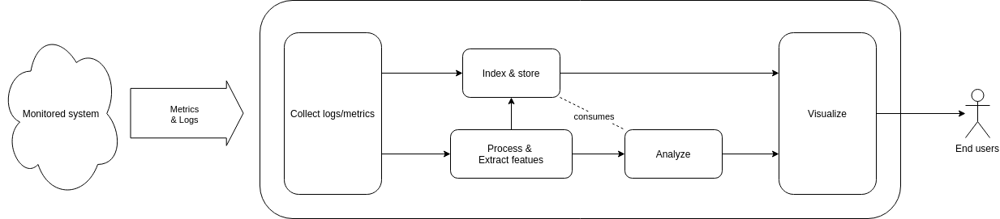

# Monitoring System for Data Processing Frameworks (DP-MON)

DP-MON is a monitoring system for payload data processing frameworks. The purpose of the DP-MON is to define a monitoring system which is agnostic to the monitored system, yet capable of extracting valuable information from log messages to identify errors that have already occurred or may occur in the near future. The DP-Mon has been designed to address following challenges.

- **Expert knowledge to interpret Monitoring/Observability data**: Most of the monitoring solutions provide metrics for resource utilization. This valuable data is used to identify the time period when the error occurred. After locating the time interval, observibility solutions are used to access log messages and investigate the root cause of the error. Although this process does not seem complicated, it requires expertise in the monitored system. 
- **Complexity of the distributed systems**: Distributed systems are essential for modern data processing systems due to their nature of being scalable and error-tolerant. However, they bring their own challenges. For example, each component of the system may be developed by a different company, each with its own logging strategy based on its own interests. Heterogeneous log messages make it difficult to relate log messages automatically across the system.
- **Hidden relations between input and output data**: Especially for payload data processing systems, the relationship between the input and output products may not be obvious. The quality or age of auxiliary data may affect higher-level products.

## Concept

- **Agnostic to the monitored system**: The system should be agnostic to the monitored system and able to handle different log message structures.
- **Extract hidden relations**: The system should be able to identify hidden relationships within the monitoring system and report accordingly. If the quality of a product is degraded due to auxiliary data that is not directly inputted into the data processing unit, the system should be able to detect this relationship and issue a report.
- **Predict error may occur in the near future**: The system should be able to predict any potential degradation in the quality or timeliness of the output by analyzing the relationship between the input and output products.

## System Design
The DP-MON system is composed of following modules:

- Collect log messages and metrics
- Process and extract features
- Index and store
- Analyze
- Visualize



### Collect Log Messages and Metrics

The ‘Collect Log Messages and Metrics’ module connects to each component of the monitored system and collects log messages and resource utilization metrics on a regular or near real-time basis. This module should be compatible with well-known protocols for collecting resource utilization metrics and should be able to support different strategies for collecting log messages such as event/message queue listening, log file polling, etc. 

There are many COTS and Open source alternatives on the market. An open source alternative will be used in the final system. 

### Process and Extract Features

Log messages can be transmitted to the monitoring system in different time sequences and in different formats. The ‘Process and Extract Features’ module sorts the log messages by time, adds metadata and extracts relevant information from them. 

The final system will use an open source observability solution to sort the logs and add metadata such as hostname of the source system, ip, source process, etc.

Some observability solutions also provide frameworks for applying algorithms to extract features from log messages. However, in this work, an NLP-based feature extraction mechanism will be implemented. By this way, the feature extraction component can automatically extract features with minimal configuration and implementation effort. 

### Index and Store

The ‘Index and Storage’ module is a database for storing log messages and metrics according to defined retention policies. During the retention period, end users can query and access log messages and metrics using the visualisation module. 

An open source document-based NoSQL solution will be used in the proposed system. 

### Analyze

The Analyze module analyses historical data and extracts the relationship between received and generated products/files. It monitors the current state of the system and takes snapshots. It uses these snapshots to predict the quality of the product before producing it. It also reports which product/file can affect the quality of the product. 

‘Neural Network’ machine learning model is used in this project. Firstly, snapshots were created from historical data and the neural network model was trained using these snapshots. After the training phase, the system continuously monitored the current state of the system and predicted the quality of the products.

### Visualize

The "Visualize" module provides a visual dashboard to monitor the health of the system and functionality to drill down the log messages and analysis results. 

An open source visualization solution will be used in the proposed system. 

## Scope and Implementation Details

This project is a proof of concept for the ‘Analyse’ module. Other modules are not yet included in this project. The Feature Extraction module is simulated by a test tool. The test tool creates records to represent product production events. These records contain only simple properties of the produced product, such as production time, file name, etc. 

```
  {
    "processing_time": "2025-06-24T12:46:23",
    "name": "TLE",
    "filename": "tle_20250624124623.txt",
    "isProduct": false,
    "quality": 0
  },
  {
    "processing_time": "2025-06-24T13:16:23",
    "name": "SAT02_INST01_RAW",
    "filename": "INST01_SAT02_GS02_20250624131523_20250624131623_35039.raw",
    "isProduct": false,
    "quality": 0
  },
  {
    "processing_time": "2025-06-24T13:16:23",
    "name": "forecast",
    "filename": "forecast_20250624131623_20250624141623_20250624131623.bin",
    "isProduct": false,
    "quality": 0
  },
  {
    "processing_time": "2025-06-24T13:18:23",
    "name": "SAT02_INST01_L0",
    "filename": "INST01_SAT02_GS02_20250624131523_20250624131623_35039_20250624131823.L0",
    "isProduct": true,
    "quality": 1.0
  },
  {
    "processing_time": "2025-06-24T13:46:23",
    "name": "TLE",
    "filename": "tle_20250624134623.txt",
    "isProduct": false,
    "quality": 0
  },
  {
    "processing_time": "2025-06-24T15:16:23",
    "name": "forecast",
    "filename": "forecast_20250624151623_20250624161623_20250624151623.bin",
    "isProduct": false,
    "quality": 0
  },
  {
    "processing_time": "2025-06-24T15:36:23",
    "name": "SAT01_INST01_RAW",
    "filename": "INST01_SAT01_GS01_20250624153323_20250624153623_01707.raw",
    "isProduct": false,
    "quality": 0
  },
  {
    "processing_time": "2025-06-24T15:36:23",
    "name": "SAT01_INST01_L0",
    "filename": "INST01_SAT01_GS01_20250624153323_20250624153623_01707_20250624153623.L0",
    "isProduct": true,
    "quality": 0.057692307692307696
  },
```
The test tool also reports the quality of the products produced. It calculates the quality using the time difference between input and output products. The calculation method and which files are used as input are hidden from the ‘Analyze’ module, but it is known that the time difference between the input files and the output product is used to calculate the quality. 

A Snapshot is list of recent file/products and the time difference between these files and the generation time of the final product. the final product might be used directly or indirectly by other products, Thus, snapshots contain all recent products in the system. Some of these files are used directly to generate the final product, some of them might have indirect relation and some of them has has no relation. during the training phase Neural Network model discover those relations and estimate the final product quality. 


| Product         | forcast   | TLE        | SAT01_INST01_RAW | SAT02_INST01_RAW| SAT01_INST01_L0| SAT02_INST01_L0| Quality Class |
|-----------------|-----------|------------|------------------|-----------------|----------------|----------------|---------------|
| SAT01_INST01_L0 | 20 min old| 110 min old| 0 min old        | 140 min old     |      N/A       |  138 min old   | 1 (Low)       | 
| SAT02_INST01_L0 | 2         | 32         | 134              | 2               | 131            |     N/A        | 10 (High)     |


## How to Run

```
#LOCAL_GIT_FOLDER#/dp-mon/analyst$ mvn clean install exec:java
```
This command compiles the application and open localhost:8080 for Rest calls. After the application is stared up, run the following command to generate historical data for last 30 days.
```
#LOCAL_GIT_FOLDER#/dp-mon/test-tools$ python generate_inputs.py -c generate_inputs.json 

```
When the historical data generation is done and processed by the Analyst application, the test tool waits for confirmation. After the confirmation it generates records for next 7 days. Each record are processed by the application and results are printed to the console tab separated. The application can be terminated with "CTRL+C". 

**Note**: if the generate_inputs returns "generate_inputs.py: KeyError('TLE')" error, please re-trigger the command again. Due to the script generates products randomly, sometimes it fails to generated first products.  

## Open Points

- [] No tuning has been applied to the Neural Network model. In order to tune the model, realistic training data should be used.
- [] 